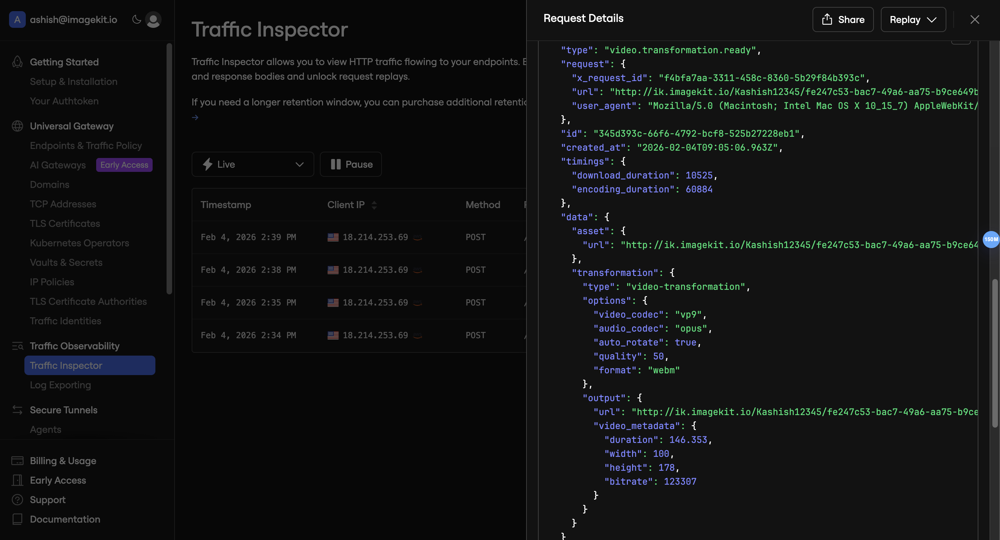

# ImageKit Webhook Endpoint

A simple Node.js server to receive and log [ImageKit webhooks](https://imagekit.io/docs/webhooks) for video processing and pre/post transformations.

## What are Webhooks?

Webhooks are automatic notifications sent by ImageKit when certain events happen (like video processing completion). Instead of constantly checking if a task is done, ImageKit sends data directly to your server.

## Features

- Receives webhooks for **Video Processing**
- Receives webhooks for **Pre/Post Transformations**
- Logs all webhook data to console
- Works with [Ngrok](https://ngrok.com) for local development

## Setup

### 1. Install dependencies

```bash
npm install
```

### 2. Start the server

```bash
node index.js
```

Server runs on `http://localhost:8001`

### 3. Expose with Ngrok

Since ImageKit needs a public URL to send webhooks, use Ngrok to expose your local server:

```bash
ngrok http 8001 --url https://your-subdomain.ngrok.io
```

This gives you a public URL like `https://your-subdomain.ngrok.io` that forwards to your local server.

## Webhook Endpoints

| Endpoint | Use Case |
|----------|----------|
| `POST /webhook/Videos/ImageKit` | Video processing events |
| `POST /webhook/Pre-Post/ImageKit` | Pre/Post transformation events |

## Configure in ImageKit Dashboard

1. Go to [ImageKit Dashboard](https://imagekit.io/dashboard) → **Settings** → **Webhooks**
2. Add your Ngrok URL as the webhook endpoint:
   - For videos: `https://your-subdomain.ngrok.io/webhook/Videos/ImageKit`
   - For transformations: `https://your-subdomain.ngrok.io/webhook/Pre-Post/ImageKit`
3. Select the events you want to receive
4. Save

## Viewing Webhook Data

### Option 1: Console Logs

When a webhook is received, you'll see output like:

```
--- Webhook Received ---
Endpoint: /webhook/Videos/ImageKit
Received at: 2026-02-04T09:05:06.963Z
Headers: { ... }
Data: {
  "type": "video-transformation",
  "video_codec": "vp9",
  "url": "https://ik.imagekit.io/...",
  ...
}
------------------------
```

### Option 2: Ngrok Traffic Inspector

Open `http://localhost:4040` in your browser to see all requests in Ngrok's Traffic Inspector:



The inspector shows:
- All incoming webhook requests
- Full request headers and body
- Option to replay requests for testing

## Example Webhook Payload

```json
{
  "type": "video-transformation",
  "video_codec": "vp9",
  "auto_rotate": true,
  "quality": 50,
  "url": "https://ik.imagekit.io/your_id/video.mp4",
  "duration": 10.53,
  "width": 500,
  "height": 500,
  "bitrate": 113307
}
```

## Project Structure

```
WebhookEndpointImageKit/
├── index.js        # Express server with webhook endpoints
├── package.json    # Dependencies
└── README.md       # This file
```

## Resources

- [ImageKit Webhooks Documentation](https://imagekit.io/docs/webhooks)
- [Ngrok Documentation](https://ngrok.com/docs)
- [ImageKit Dashboard](https://imagekit.io/dashboard)

## License

ISC

---

Developed by **Ashish**
